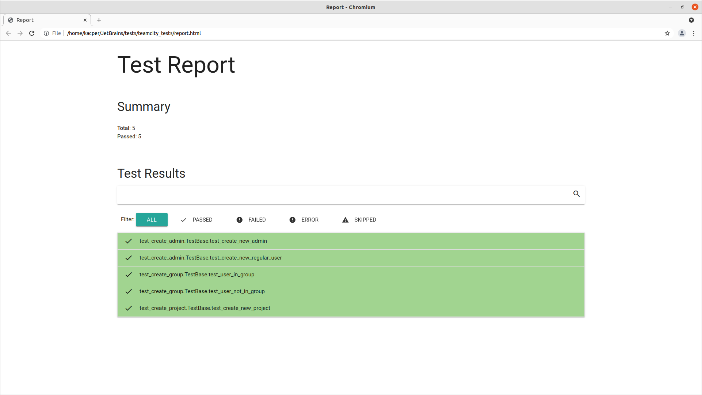

# TeamCity automated tests

## Prerequests
- python3.x
- pip3
- Chrome browser installed
- TeamCity running on `http://localhost:8111` [otherwise value should be changed in `./config/environment.py` and in all `./config/*.sh` scripts]

## Configuration
1. clone repo
2. install Python requirements: `pip3 install -r requirements.txt`
3. run bash script for extracting SuperUser password, eg.:
    `sh ./config/getSuperUser.sh ~/JetBrains/TeamCity/` where `~/JetBrains/TeamCity/` is your TeamCity application path. The script localize automatically current session's SuperUser password from log file and saves it into local file for further use.
    ***
    NOTE

    Step 3. needs to be done every time after starting TC application, hence the SuperUser token in being generated on application boot.
    ***
4. Create admin user and run token API generator script: `sh ./config/generateToken.sh userName password tokenName`.

## Execution    
 1. go to tests directory: `cd tests`
 2. run tests: `nose2 -c ./../config/nose2.cfg`

## Results
 After the run test report should be generated in main directory: `./report.html`

 